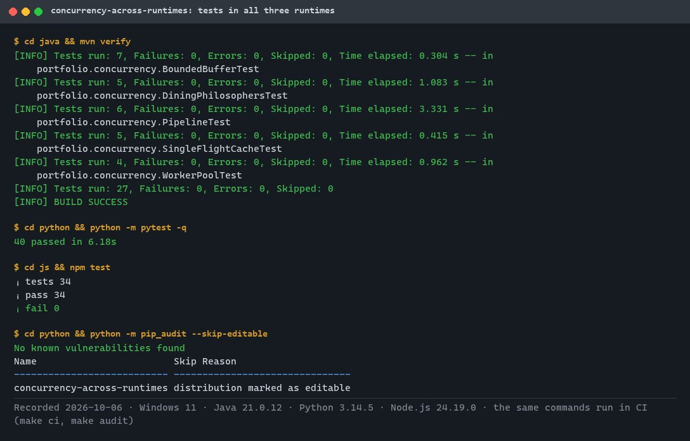
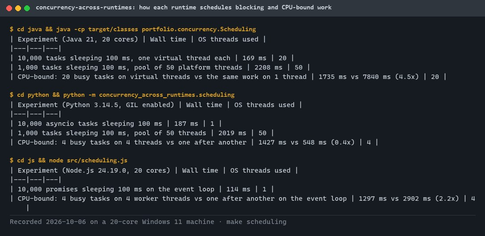
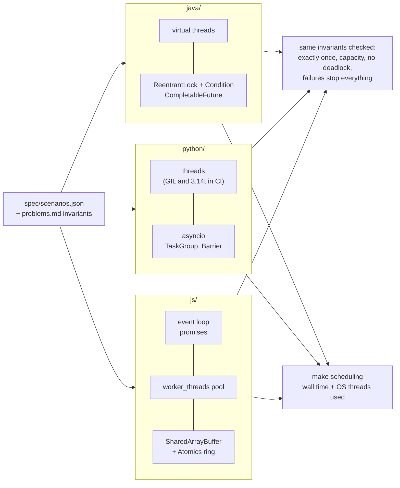
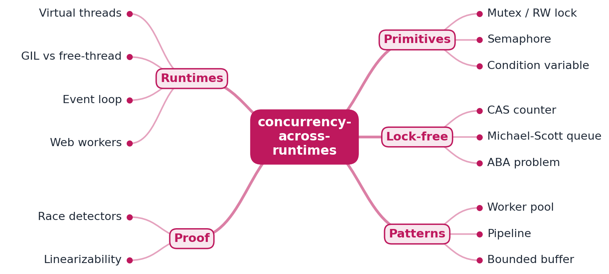
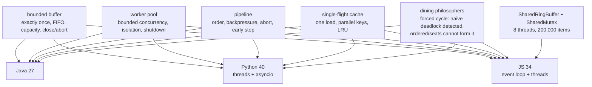

# concurrency-across-runtimes

[](https://github.com/EquinoxWN/concurrency-across-runtimes/actions/workflows/ci.yml)


> The same five concurrency problems solved in Java, Python and JavaScript and checked against the same invariants, to show how each runtime really schedules work.

Part of my **CS Foundations** list · Java · Python · JS · core project

## Proof it works

All five problems pass the same invariants in Java, Python and JavaScript (101 tests), and the dependency audit is clean:



`make scheduling` shows what each runtime really does with 10,000 sleeping tasks and with CPU-bound work. Note Python's 0.4x: with the GIL, four busy threads are slower than running one after another.



## Architecture

**What M1 runs today:**



**Full roadmap (M1 to M3):**



## How it works

_Steps 1 and 2 are built and tested (M1); the rest is on the [roadmap](#roadmap)._

1. Five shared problems (bounded buffer, worker pool, pipeline, concurrent cache, dining philosophers) are solved in Java, Python and JavaScript.
2. Java uses virtual threads and java.util.concurrent, Python compares asyncio, threads and the free-threaded build, JavaScript uses the event loop plus worker_threads and Atomics.
3. A lock-free Michael-Scott queue in Java demonstrates compare-and-swap and the ABA problem.
4. Stress tests run under OpenJDK's jcstress and Python's ThreadSanitizer, and histories are checked for linearizability with Porcupine.
5. Throughput and latency are measured as cores increase, showing where locks contend and which model scales.
6. The write-up explains the Java memory model, and how the GIL or a single-threaded event loop changes the design.

## Who it helps

- **Who:** Developers who move between Java, Python and JavaScript, or who are chasing a concurrency bug.
- **The problem:** The same pattern (a bounded buffer, a worker pool) behaves differently on threads, an event loop or under the GIL, and those differences cause real bugs.
- **How to use it:** Read the five problems solved side by side in each runtime and run the tests, which check every solution against the same invariants.

## Tech stack

| Area | In M1 | Planned |
|---|---|---|
| Runtimes | Java virtual threads + java.util.concurrent, Python threads and asyncio (also on the free-threaded build in CI), JS event loop + worker_threads | Lock-free Michael-Scott queue |
| Test | Shared scenarios and invariants in every language | OpenJDK jcstress, ThreadSanitizer, Porcupine linearizability checks |
| Bench | - | Throughput and latency at rising core counts |

One implementation per language, each in its own folder: [`java/`](java) (Maven), [`python/`](python) (threads and asyncio side by side) and [`js/`](js) (Node.js, type-checked with `tsc --checkJs`). The problems and their invariants are in [`spec/problems.md`](spec/problems.md); every test suite reads [`spec/scenarios.json`](spec/scenarios.json).

## Run it

**Prerequisites:** JDK 21+ with Maven, Python 3.11+ and Node.js 24+. Everything installs inside the repo.

```bash
python -m venv .venv && source .venv/bin/activate   # Windows: .venv\Scripts\activate
make setup        # Python dev tools, npm packages
make lint         # javac -Werror, ruff + mypy --strict, tsc --checkJs --strict
make test         # 101 tests across the three runtimes
make scheduling   # how each runtime schedules sleeping and CPU-bound tasks
```

One language at a time: `cd java && mvn verify`, `cd python && python -m pytest`, `cd js && npm test`.

### The five problems

| Problem | What can go wrong | What the tests prove, in every runtime |
|---|---|---|
| Bounded buffer | Lost or duplicated items, a queue that grows without limit | 4 producers x 2,000 items: every item exactly once, FIFO per producer, never more than 4 queued |
| Worker pool | Too many tasks at once, one failure killing the pool, tasks lost at shutdown | At most 4 tasks run at once and all 4 are used; a failure only fails its own future; shutdown drains, then rejects |
| Pipeline | A slow stage flooding memory, a failure leaving workers running | Output equals the sequential loop; buffers fill but never overflow; one failure names the stage and item, stops early, and leaves no worker behind |
| Single-flight cache | 64 requests for one missing key hitting the database 64 times | One load for 64 callers, parallel loads for different keys, failures not cached, LRU eviction |
| Dining philosophers | Deadlock | The deadlocking schedule is forced: the naive strategy deadlocks and is detected (not hung); the ordered and seats strategies cannot form the cycle and eat all 1,000 meals |

### How each runtime schedules work (`make scheduling`, one run)

| Experiment | Wall time | OS threads |
|---|---|---|
| Java: 10,000 tasks sleeping 100 ms, one virtual thread each | 181 ms | 20 |
| Java: 1,000 tasks sleeping 100 ms on 50 platform threads | 2,229 ms | 50 |
| Python: 10,000 asyncio tasks sleeping 100 ms | 186 ms | 1 |
| Python (GIL): 4 CPU-bound tasks on 4 threads vs sequential | 0.9x (no speedup) | 4 |
| Java: 20 CPU-bound tasks on virtual threads vs 1 thread | 14.0x | 20 |
| Node.js: 4 CPU-bound tasks on worker threads vs the event loop | 3.5x | 4 |

## Tests and results

Full numbers and commands: [docs/results/m1.md](docs/results/m1.md).

| Check | Result |
|---|---|
| Tests (`make test`) | **101 passed** (Java 27, Python 40, JavaScript 34), 0 failed |
| Lint (`make lint`) | clean: javac `-Xlint:all -Werror`, ruff, ruff format, mypy `--strict`, tsc `--checkJs --strict` |
| Free-threaded Python | the Python suite also runs on 3.14t with the GIL disabled (CI job) |
| Flakiness | every suite repeated after the last change; all runs passed |
| Mutation check | 7 deliberate bugs (one per problem area and runtime), each caught |
| Audit | `pip-audit` and `npm audit`: no known vulnerabilities |

| Test file | What it proves |
|---|---|
| `BoundedBufferTest`, `test_buffer.py`, `buffer.test.js` | Exactly-once delivery, FIFO per producer, the capacity bound, close and abort waking every waiter |
| `WorkerPoolTest`, `test_pool.py`, `pool.test.js` | Bounded concurrency, failure isolation, shutdown, backpressure on submit; JS tasks run on real OS threads |
| `PipelineTest`, `test_pipeline.py`, `pipeline.test.js` | Sequential equivalence, backpressure, one failure stopping every stage (`TaskGroup` cancellation in asyncio) |
| `SingleFlightCacheTest`, `test_cache.py`, `cache.test.js` | One load per key under contention, parallel keys proved with a rendezvous, failures not cached, LRU |
| `DiningPhilosophersTest`, `test_philosophers.py`, `philosophers.test.js` | Forced circular wait: detected deadlock vs impossible cycle |
| `shared-ring.test.js` | Futex-style mutex and ring buffer in `SharedArrayBuffer`, 8 threads moving 200,000 items with none lost |

### Test map



## Roadmap

**M1** (≈15 h)
- [x] Write `docs/rfc/0001-design.md`: problem, goals, non-goals, chosen design
- [x] Five shared problems (bounded buffer, worker pool, pipeline, concurrent cache, dining philosophers) are solved in Java, Python and JavaScript.
- [x] Java uses virtual threads and java.util.concurrent, Python compares asyncio, threads and the free-threaded build, JavaScript uses the event loop plus worker_threads and Atomics.

**M2** (≈20 h)
- [ ] A lock-free Michael-Scott queue in Java demonstrates compare-and-swap and the ABA problem.
- [ ] Stress tests run under OpenJDK's jcstress and Python's ThreadSanitizer, and histories are checked for linearizability with Porcupine.

**M3** (≈25 h)
- [ ] Throughput and latency are measured as cores increase, showing where locks contend and which model scales.
- [ ] The write-up explains the Java memory model, and how the GIL or a single-threaded event loop changes the design.
- [ ] Publish the proof below with real numbers

## Proof

What this repo must show before it counts as done:

- Scaling charts by core count, and a real race caught by the detector with its fix.

| Result | Value |
|---|---|
| M3 proof above | Not measured yet (M3). Current M1 numbers: see [Tests and results](#tests-and-results). |

## Why it matters

- **Interview angle:** 'Design a thread-safe cache or job scheduler' and the follow-up 'what happens under contention?'
- **Upstream I'd like to contribute to:** OpenJDK (Project Loom) issues; CPython free-threading bug reports with reproducers.

## Design docs

- [RFC 0001: design](docs/rfc/0001-design.md)
- [ADR 0001: record architecture decisions](docs/adr/0001-record-architecture-decisions.md)
- [ADR 0002: detect deadlock with timeouts and forced schedules](docs/adr/0002-detect-deadlock-with-timeouts-and-forced-schedules.md)
- [ADR 0003: every queue is bounded](docs/adr/0003-bounded-queues-everywhere.md)
- [M1 results](docs/results/m1.md)

## Scope

This is a learning and portfolio system, not a hosted production service. Everything runs locally.

## Security and contributing

- Every GitHub Action is pinned to a commit SHA; workflows run read-only, without persisted credentials.
- Dependabot proposes dependency and action updates weekly.
- CI runs `pip-audit` and `npm audit` on every push (Java dependencies are covered by Dependabot alerts), and every test suite has a timeout so a deadlock fails the build instead of hanging it.
- Report vulnerabilities privately: see [SECURITY.md](SECURITY.md). To contribute, see [CONTRIBUTING.md](CONTRIBUTING.md).

## License

MIT, see [LICENSE](LICENSE).
